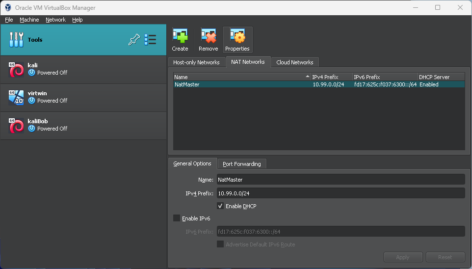
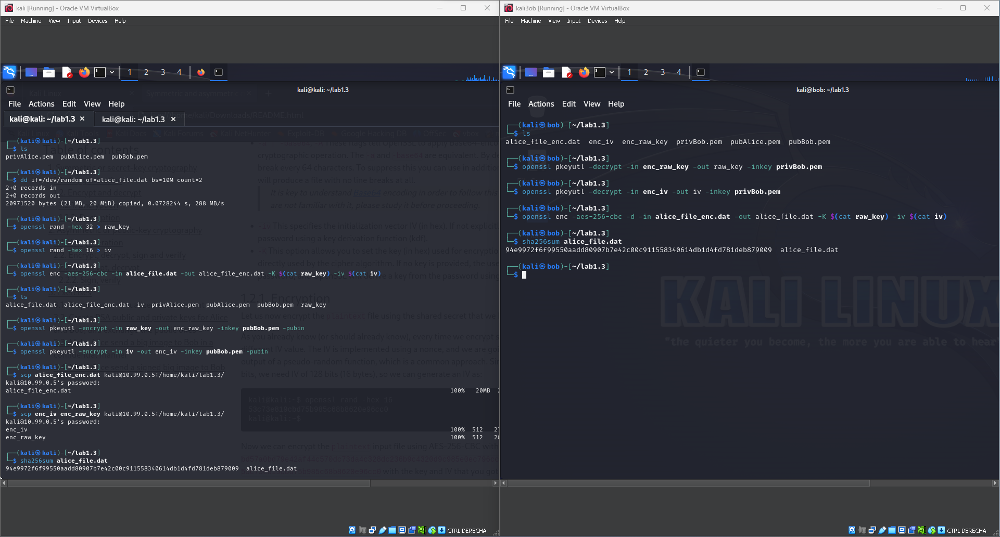
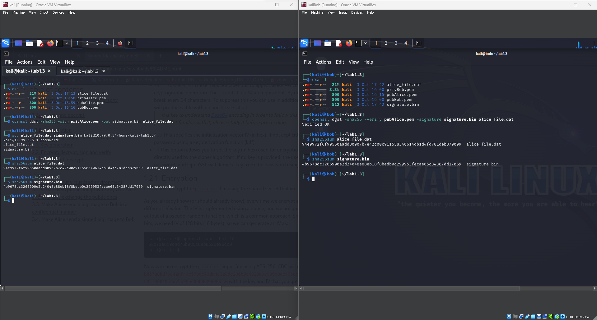

# NS - Lab 1 - Jordi Solà <!-- omit in toc -->

- [3.1. Prepare your virtualized environment](#31-prepare-your-virtualized-environment)
- [3.2. Create RSA public and private keys for Alice and Bob, and exchange the public ones](#32-create-rsa-public-and-private-keys-for-alice-and-bob-and-exchange-the-public-ones)
- [3.3. Make Alice send a big image to Bob in a confidential manner](#33-make-alice-send-a-big-image-to-bob-in-a-confidential-manner)
- [3.4. Make Alice send a signed big image to Bob](#34-make-alice-send-a-signed-big-image-to-bob)

## 3.1. Prepare your virtualized environment

After creating the two virtual machines, I created a NAT network where they could communicate with each other throught the virtual network.
|  | 
|:--:| 
| *Image 1* |

Then I changed one hostname from `kali` to `bob` and left the other as `kali` as it will be clear enought who is who. To do so I only did follow the instructions given in the guideline.

> sudo hostnamectl set-hostname bob  
> edit /etc/hosts

As I prefered to use the network for file transfers, I had to enable `ssh` instead of creating a shared folder. I achieved this by issuing two commands (only one needed but both for permanent enabling) on both machines:

> sudo systemctl enable ssh  
> sudo systemctl start ssh

**Environment prepared! Let's keep going.**

## 3.2. Create RSA public and private keys for Alice and Bob, and exchange the public ones

 

|  | 
|:--:| 
| *Image 2* |

As shown in `Image 2` we created a private key with `openssl genrsa -out privAlice.pem 4096`, and we extracted the public with `openssl rsa -in privAlice.pem -pubout -out pubAlice.pem`. Same steps for *Bob*.  
Then we shared the public via `scp` (arbitrary program, as the sharing method was not really important)

## 3.3. Make Alice send a big image to Bob in a confidential manner

 

|  | 
|:--:| 
| *Image 3* |

Now, *Alice* has it's public and private and bob's public key. *Bob* has it's public and private and alice's public key.  
Alice creates a random file (simulating an image) of exactly 20MiB. We create a random key and random IV. We then encrypt the file with AES using that key and IV and then, we encrypt the key and IV with RSA using *Bob*'s public key. Now we can share the encrypted file, key and IV.  
Bob will start decrypting the key and IV with his private key, then will decrypt the file using those two decrypted files.

We check that the file is the same with `sha256sum`.

## 3.4. Make Alice send a signed big image to Bob

 

|  | 
|:--:| 
| *Image 4* |

Finally, using the same random file, we get a signature from it via `openssl dgst -sha256 -sign privAlice.pem -out signature.bin alice_file.dat`. This will create a signature with Alice's private key.  
Then we send the `alice_file.dat` and `signature.bin` to Bob. Bob will just need to verify using the command `openssl dgst -sha256 -verify pubAlice.pem -signature signature.bin alice_file.dat`. Here, we are using Alice's public key to decrypt the signed file.

Then, we check the integrity of the files with `sha256sum` again