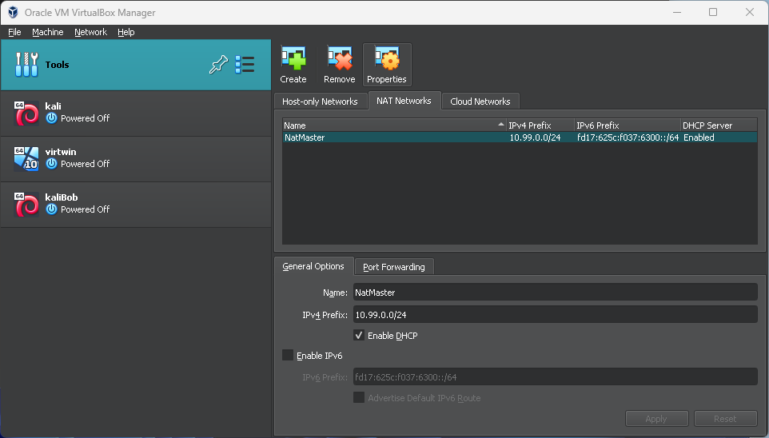
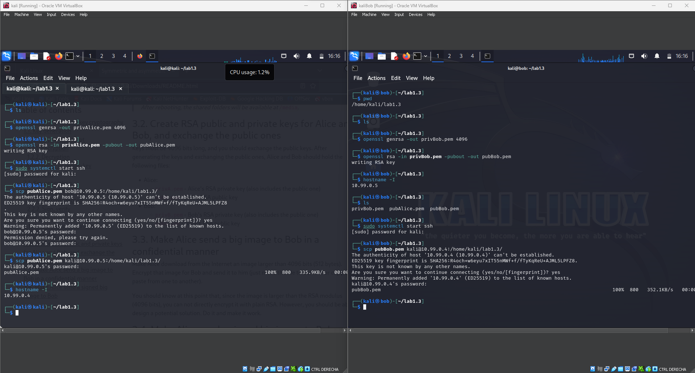
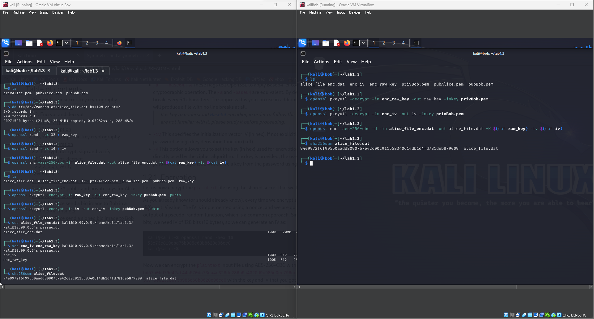
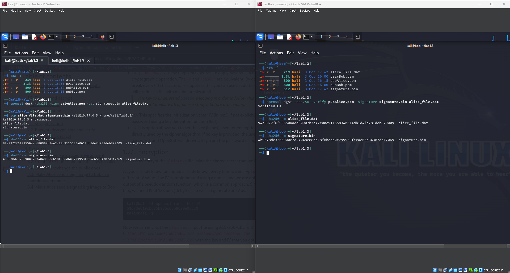

# NS - Lab 1 - Jordi Solà <!-- omit in toc -->

- [3.1. Prepare your virtualized environment](#31-prepare-your-virtualized-environment)
- [3.2. Create RSA public and private keys for Alice and Bob, and exchange the public ones](#32-create-rsa-public-and-private-keys-for-alice-and-bob-and-exchange-the-public-ones)
- [3.3. Make Alice send a big image to Bob in a confidential manner](#33-make-alice-send-a-big-image-to-bob-in-a-confidential-manner)
- [3.4. Make Alice send a signed big image to Bob](#34-make-alice-send-a-signed-big-image-to-bob)
  - [Optional work - DHKE](#optional-work---dhke)

<div style="page-break-after: always;"></div>

## 3.1. Prepare your virtualized environment

After creating the two virtual machines, I created a NAT network where they could communicate with each other throught the virtual network.
|  | 
|:--:| 
| *Image 1* |

Then I changed one hostname from `kali` to `bob` and left the other as `kali` as it will be clear enought who is who. To do so I only did follow the instructions given in the guideline.

> sudo hostnamectl set-hostname bob <br>
> edit /etc/hosts

As I prefered to use the network for file transfers, I had to enable `ssh` instead of creating a shared folder. I achieved this by issuing two commands (only one needed but both for permanent enabling) on both machines:

> sudo systemctl enable ssh <br>
> sudo systemctl start ssh

**Environment prepared! Let's keep going.**

<div style="page-break-after: always;"></div>

## 3.2. Create RSA public and private keys for Alice and Bob, and exchange the public ones

<br>

|  | 
|:--:| 
| *Image 2* |

As shown in `Image 2` we created a private key with `openssl genrsa -out privAlice.pem 4096`, and we extracted the public with `openssl rsa -in privAlice.pem -pubout -out pubAlice.pem`. Same steps for *Bob*. <br>
Then we shared the public via `scp` (arbitrary program, as the sharing method was not really important)

<div style="page-break-after: always;"></div>

## 3.3. Make Alice send a big image to Bob in a confidential manner

<br>

|  | 
|:--:| 
| *Image 3* |

Now, *Alice* has it's public and private and bob's public key. *Bob* has it's public and private and alice's public key. <br>
Alice creates a random file (simulating an image) of exactly 20MiB. We create a random key and random IV. We then encrypt the file with AES using that key and IV and then, we encrypt the key and IV with RSA using *Bob*'s public key. Now we can share the encrypted file, key and IV. <br>
Bob will start decrypting the key and IV with his private key, then will decrypt the file using those two decrypted files.

We check that the file is the same with `sha256sum`.

<div style="page-break-after: always;"></div>

## 3.4. Make Alice send a signed big image to Bob

<br>

|  | 
|:--:| 
| *Image 4* |

Finally, using the same random file, we get a signature from it via `openssl dgst -sha256 -sign privAlice.pem -out signature.bin alice_file.dat`. This will create a signature with Alice's private key. <br>
Then we send the `alice_file.dat` and `signature.bin` to Bob. Bob will just need to verify using the command `openssl dgst -sha256 -verify pubAlice.pem -signature signature.bin alice_file.dat`. Here, we are using Alice's public key to decrypt the signed file.

Then, we check the integrity of the files with `sha256sum` again


### Optional work - DHKE

    Motivation
    In order to guarantee Perfect Forward Secrecy (PFS) it would have been desirable to agree the key using a Diffie Hellman (DH) protocol. For that purpose, you would need Alice and Bob to generate their private (aa and bb) and public (gagamodp and gbgbmodp) DH parameters, to securely exchange the public parameters, to compute the agreed DH secret, and to derive a 256bits master key from it (e.g. using the openssl dgst command). Try to find a solution your self. You can use this web page as a source of inspiration.

Let's go to the most extreme case: `PK mutual auth (with PKI) & master key & PFS` - We are Alice

Let's generate a certificate with the RSA private key:
```bash
openssl req -new -x509 -key privAlice.pem -out certAlice.pem -days 360
```

We can generate a nonce as well (best way to do so is combining the timestamp with a random num):
```bash
echo "$(date +%s)-$(openssl rand -hex 8)" > nonceAlice
```

Then, we need to generate the Diffie-Hellman global public parameters, saving them in the file `dhp.pem`:
```bash
openssl genpkey -genparam -algorithm DH -pkeyopt dh_paramgen_prime_len:2048 -out dhp.pem
openssl pkeyparam -in dhp.pem -text  # Check it worked
```

On user 1:
```bash
openssl genpkey -paramfile dhp.pem -out dhkeyAlice.pem  # Generate the private and public key
openssl pkey -in dhkeyAlice.pem -text -noout  # Check it all worked correctly
openssl pkey -in dhkeyAlice.pem -pubout -out dhpubAlice.pem  # Get the public key from the private one
openssl pkey -pubin -in dhpubAlice.pem -text  # Check it
```
Issue the same commands on user 2.

---

Then, we send to the other one our `certAlice.pem`, the `nonceAlice` and the `dhp.pem`.
Bob will give us back his `certBob.pem`, and he will encrypt his `nonceBob` our `nonceAlice` and his `dhpubBob.pem`.
```bash
openssl rsautl -encrypt -pubin -inkey certAlice.pem -in nonceAlice -out encrypted_nonceAlice
openssl rsautl -encrypt -pubin -inkey certAlice.pem -in nonceBob -out encrypted_nonceBob
openssl rsautl -encrypt -pubin -inkey certAlice.pem -in dhpubBob.pem -out encrypted_dhpubBob.pem
```

Alice can obviously decrpyt those with the DH private key.
```bash
openssl rsautl -decrypt -inkey dhkeyAlice.pem -in encrypted_nonceAlice -out nonceAlice
# Same for other files
```

Alice is secure Bob is who he says he is. Now Bob needs to be secure as well.
Alice now must encrypt and send to Bob his `nonceBob` and his own `dhpubAlice.pem`.
_Same commands..._

Now they are secure they both are who they say they are.

Create the shared secret:
```bash
openssl pkeyutl -derive -inkey dhkeyAlice.pem -peerkey dhpubBob.pem -out secret.bin
```

To generate a session key, we must agree what PRF we use. Let's just say we use HMAC-SHA256:

```bash
xxd -p secret.bin > secret.hex  # As we have the secret in binary, we need it in hex (it is not correct as it includes newlines in this file but as long as they both generate the key in the same way, it will always work)
echo "$(cat nonceAlice),$(cat nonceBob),enc,1,$(cat secret.hex)" | openssl dgst -sha3-256 -hex | awk '{print $2}' > k_enc_A_B.hex
```