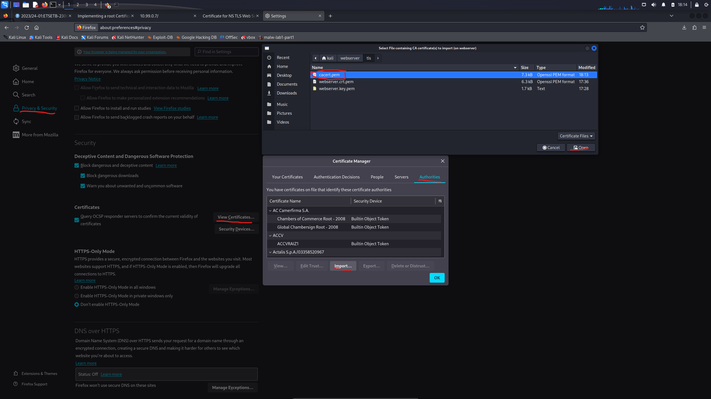
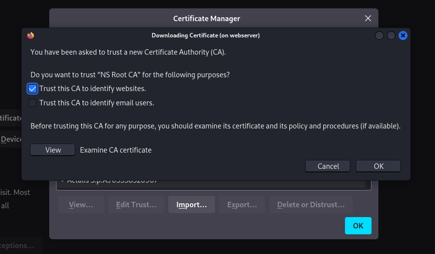
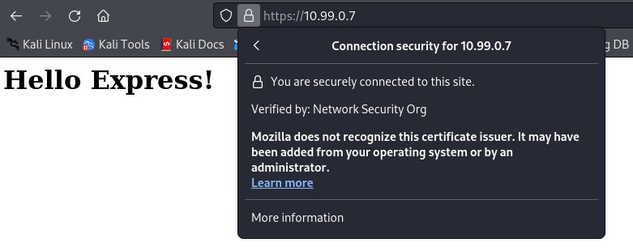
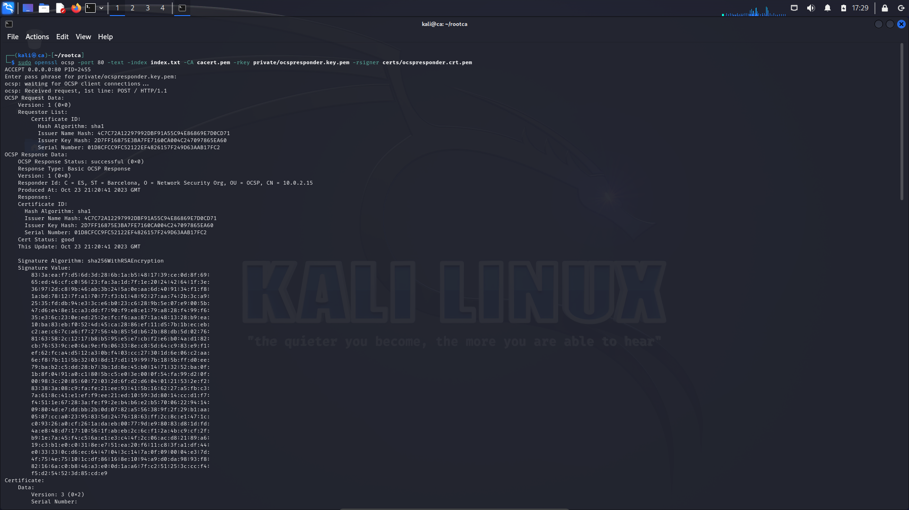
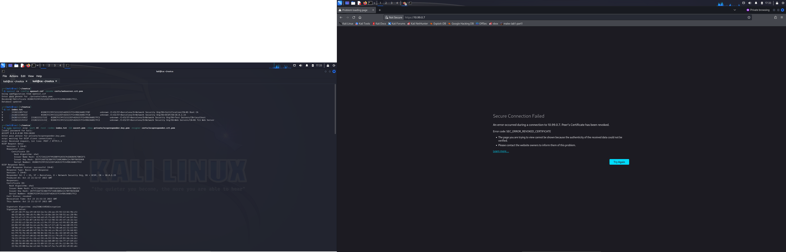
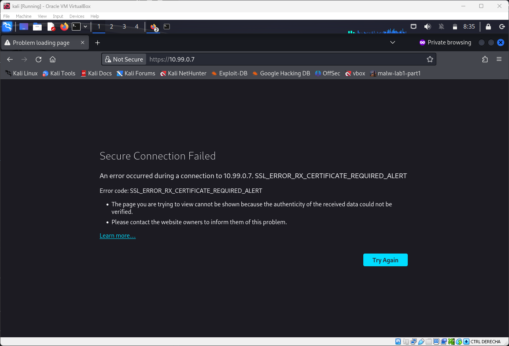
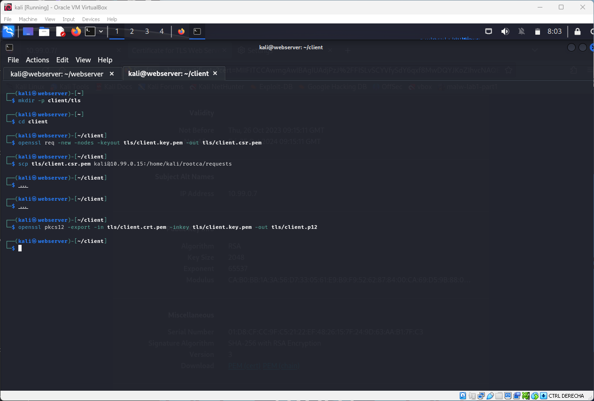
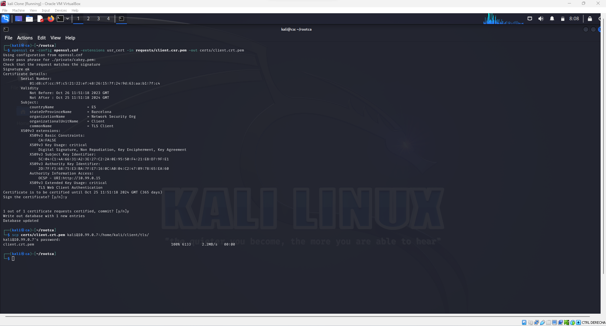
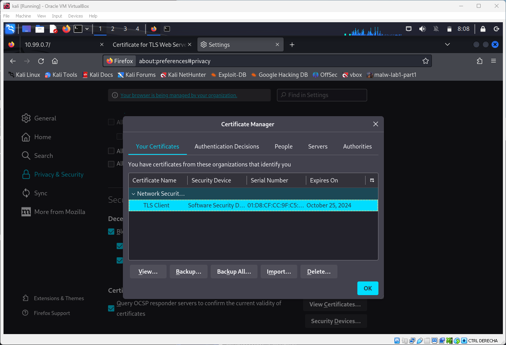
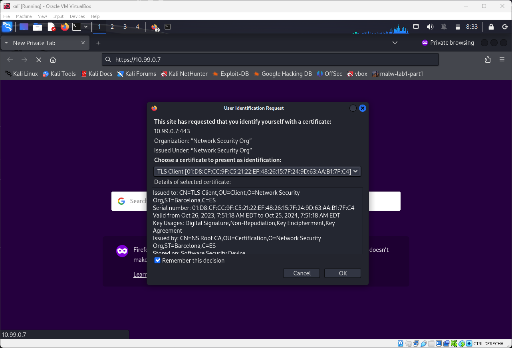

# [NS - Lab2] - Implementing a root Certification Authority with OpenSSL <!-- omit in toc -->

- [3.1 Test your TLS webserver with a web browser](#31-test-your-tls-webserver-with-a-web-browser)
  - [3.1.1 - Install the CA’s certificate on the client’s web browser](#311---install-the-cas-certificate-on-the-clients-web-browser)
  - [3.1.2 - Connect the browser to the server https://10.0.2.7](#312---connect-the-browser-to-the-server-https10027)
  - [3.1.3 - Check that the connection does not raise any warnings (unless the server’s certificate had an inappropriate subjectAltName extension)](#313---check-that-the-connection-does-not-raise-any-warnings-unless-the-servers-certificate-had-an-inappropriate-subjectaltname-extension)
  - [3.1.4 - Check also that the web browser has also queried your OCSP responder to check the status of the server's certificate](#314---check-also-that-the-web-browser-has-also-queried-your-ocsp-responder-to-check-the-status-of-the-servers-certificate)
  - [3.1.5 - Revoke the webserver's certificate and check that the browser is not letting you in since the certificate is revoked](#315---revoke-the-webservers-certificate-and-check-that-the-browser-is-not-letting-you-in-since-the-certificate-is-revoked)
- [3.2 - Authenticate to your webserver using a client certificate](#32---authenticate-to-your-webserver-using-a-client-certificate)
  - [3.2.1 - Prepare your webserver](#321---prepare-your-webserver)
  - [3.2.2 - Prepare your client](#322---prepare-your-client)


<div style="page-break-after: always;"></div>

## 3.1 Test your TLS webserver with a web browser

### 3.1.1 - Install the CA’s certificate on the client’s web browser

|  | 
|:--:| 
| *Image 1* |

|  | 
|:--:| 
| *Image 2* |

Here we just go to our web browser (Firefox in this case) and search and install for our new root CA certificate.

### 3.1.2 - Connect the browser to the server https://10.0.2.7

|  | 
|:--:| 
| *Image 3* |

Certificate seems fine! Let's keep going.

### 3.1.3 - Check that the connection does not raise any warnings (unless the server’s certificate had an inappropriate subjectAltName extension)

|  | 
|:--:| 
| *Image 4* |

Alt name properly configured.

### 3.1.4 - Check also that the web browser has also queried your OCSP responder to check the status of the server's certificate

|  | 
|:--:| 
| *Image 5* |

OCSP responder works properly.

### 3.1.5 - Revoke the webserver's certificate and check that the browser is not letting you in since the certificate is revoked

|  | 
|:--:| 
| *Image 6* |

Certificate revoked on the Root CA and webserver is no longer accessible because the cert is revoked. OCSP responder reports it correctly.


## 3.2 - Authenticate to your webserver using a client certificate

Before we continue, we need to issue a new certificate for the webserver, so we going back to commands from `## 2.1 - Getting a certificate for your webserver`: <br>
In webserver:
```bash
openssl req -new -addext 'subjectAltName = IP:10.99.0.7' -nodes -keyout tls/webserver_new.key.pem -out webserver_new.csr.pem
scp webserver_new.csr.pem kali@10.99.0.15:/home/kali/rootca/requests
```
In rootca:
```bash
openssl ca -config openssl.cnf -extensions server_cert -in requests/webserver_new.csr.pem -out certs/webserver_new.crt.pem
scp certs/webserver_new.crt.pem kali@10.99.0.7:/home/kali/webserver/tls
```
Back to webserver, as we changed the name of the cert, we need to edit `index.js`:
```js
const tlsServerKey = fs.readFileSync('./tls/webserver_new.key.pem');
const tlsServerCrt = fs.readFileSync('./tls/webserver_new.crt.pem');
```
And now we are ready to communicate with our webserver with a new and valid certificate.

> Note: It is, in theory, possible to re-revoke the revoked cert but it is never safe to do so.

### 3.2.1 - Prepare your webserver

There are various ways to achieve so, one would be:

```js
const clientAuth = () => (req, res, next) => {
  if (!req.client.authorized) {
    return res.status(401).send('Invalid cient certificate authentication.')
  }
  return next();
}

app.use(logger('dev'), clientAuth());
```

But this is a middleware approach. It could potentially introduce complexities or differences in the way the browser and server handle client certificate authentication.

So, instead, we using a method that aligns with the standard SSL/TLS handshake process. The final webserver code would be:

```js
'use strict';

const express = require('express');
const logger = require('morgan');
const https = require('https');
const fs = require('fs');

const tlsServerKey = fs.readFileSync('./tls/webserver_new.key.pem');
const tlsServerCrt = fs.readFileSync('./tls/webserver_new.crt.pem');
const caCert = fs.readFileSync('./tls/cacert.pem');

const app = express();

app.use(logger('dev'));

app.get('/', (request, response) => {
    response.send('<h1>Hello Express</h1>');
});

const httpsOptions = {
    key: tlsServerKey,
    cert: tlsServerCrt,
    ca: caCert, // Provide the CA cert
    requestCert: true, // Request client cert
    rejectUnauthorized: true // Reject connections without a valid client certificate
};
const server = https.createServer(httpsOptions, app);

/**
 * Listen on provided port, on all network interfaces.
 */
server.listen(443);
server.on('listening', onListening);

/**
 * Event listener for HTTP server "listening" event.
 */
function onListening() {
    const addr = server.address();
    const bind = typeof addr === 'string'
        ? 'pipe ' + addr
        : 'port ' + addr.port;
    console.log('Listening on ' + bind);
}
```
In this case, we are never entering the website because the headers kick us out, which is more secure.

> Before we continue, let's check what happens if we try to access the website without the client certificate:
>  <br>
> As expected, we are not allowed to access the website.

### 3.2.2 - Prepare your client

|  | 
|:--:| 
| *Image 8* |

We create a key and cert for the client, and send the cert to the root CA for it to sign it.

|  | 
|:--:| 
| *Image 9* |

Root CA signs it and return it to the client.

Back to `Image 7`, we generate a `PKCS #12 file` with the key and the signed cert.

|  | 
|:--:| 
| *Image 10* |

We import that `.p12` file to firefox.

|  | 
|:--:| 
| *Image 11* |

Once we access the website, firefox asks us if that cert is the one to be used and... _viola_ we are inside!