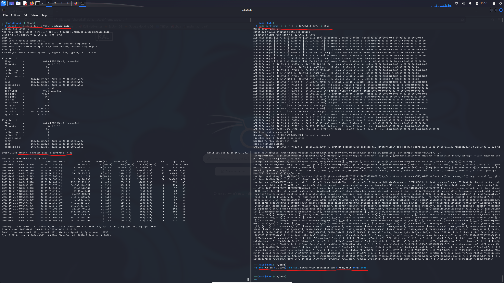
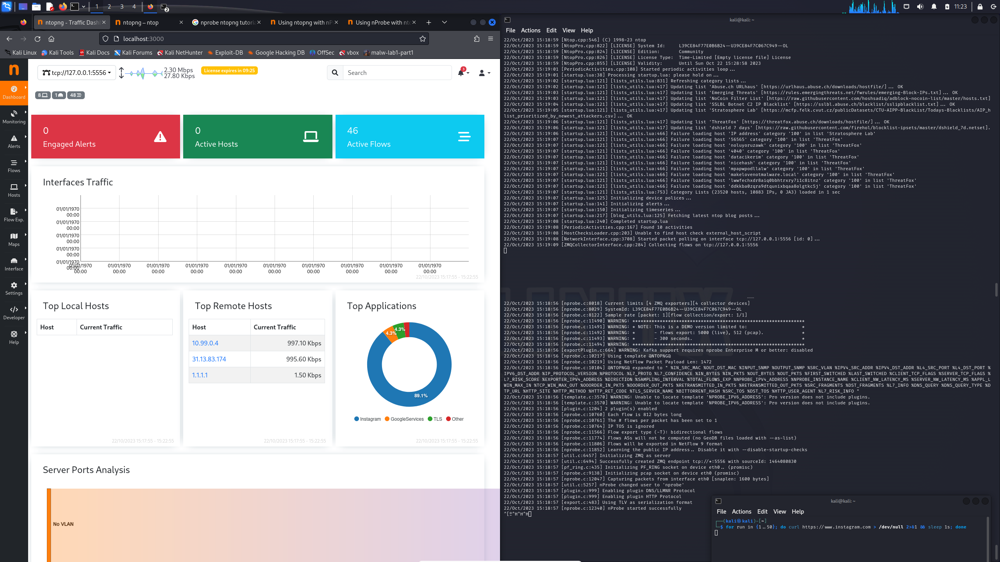
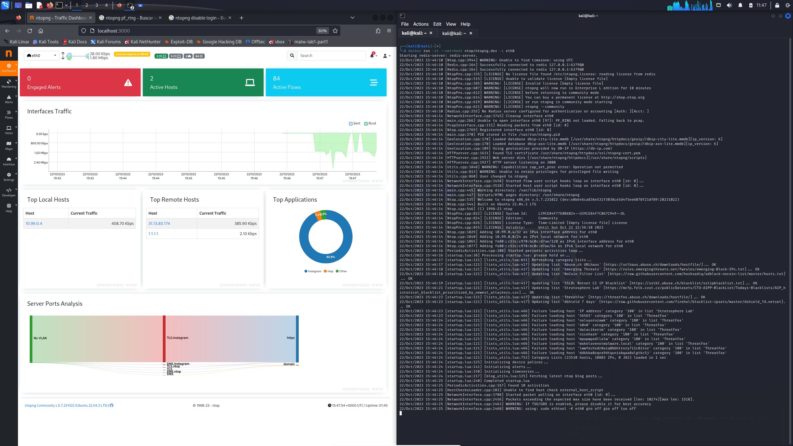

# Unit 2 - NetFlow Exercice

## Exercise 1

1. Install nfdump and softflowd
   > sudo apt install nfdump softflowd

1. Set up NetFlow collector using '`nfcapd`'. The collector should listen to NetFlow data at `127.0.0.1:9995`
   > `nfcapd` is installed with `nfdump` installation so it's already on our system. With `man nfcapd` we can notice that the option `-p` let's you select the port number, the option `-b` specifies the listening address and the option `-w` sets the output directory to store the flows:  
   '`nfcapd -p 9995 -l 127.0.0.1 -w nfcapd-data`' is the desired command, where 'nfcapd-data' is a folder in the cwd

1. Set up NetFlow exporter using '`softflowd`'
   > `sudo softflowd -d -D -v 5 -n 127.0.0.1:9995 -i eth0`  
   Flags:  
         &nbsp;&nbsp;&nbsp;&nbsp;&nbsp;&nbsp;`-n`: host:port  
         &nbsp;&nbsp;&nbsp;&nbsp;&nbsp;&nbsp;`-i`: interface  
         &nbsp;&nbsp;&nbsp;&nbsp;&nbsp;&nbsp;`-D`: debug mode (this implies `-d`)  
         &nbsp;&nbsp;&nbsp;&nbsp;&nbsp;&nbsp;`-d`: do not fork and deamonise (redundant cause of `-D`)  
         &nbsp;&nbsp;&nbsp;&nbsp;&nbsp;&nbsp;`-v`: NetFlow version for exporting the data  

1. Use '`nfdump`' to inspect the flows collected and show top 20 IPaddr by bytes.
   > `nfdump -R nfcapd-data -s ip/bytes -n 20`  
   Flags:  
         &nbsp;&nbsp;&nbsp;&nbsp;&nbsp;&nbsp;`-R`: filelist  
         &nbsp;&nbsp;&nbsp;&nbsp;&nbsp;&nbsp;`-s`: statistic options  
         &nbsp;&nbsp;&nbsp;&nbsp;&nbsp;&nbsp;`-n`: number to be printed  

      

1. Configure nfcapd/softflowd to use a sampling rate of 1/10
   > To use '`nfcapd`' at a sampling rate of 1/10 just add `-s 10`:  
   `nfcapd -p 9995 -l 127.0.0.1 -w nfcapd-data -s 10`  
   To set '`softflowd`' at the same sampling rate, add the same flag and samplign rate:  
   `sudo softflowd -d -D -v 5 -n 127.0.0.1:9995 -i eth0 -s 10`

1. Install NfSen and use it to display NetFlow data graphically 

## Exercice 2

1. Repeat exercise 1 but now using nprobe as flow collector (instead of ncapd) and ntopng as (a graphical) flow analyzer (instead of nfdump/nfsen)
   > Opted to install it via docker:  
   First we start nprobe, as ntopng depends on it.
   `docker run -it --net=host ntop/nprobe.dev --ntopng "tcp://*:5556" -i eth0 -n none -T "@NTOPNG@"`  
   Docker flags:  
         &nbsp;&nbsp;&nbsp;&nbsp;&nbsp;&nbsp;`-it`: Run interactively and attached to the TTY  
         &nbsp;&nbsp;&nbsp;&nbsp;&nbsp;&nbsp;`--net=host`: Tells docker to use host's network inside the container  
   Container flags:  
         &nbsp;&nbsp;&nbsp;&nbsp;&nbsp;&nbsp;`--ntopng "tcp://*:5556"`: Opens communication with ntopng at this TCP port  
         &nbsp;&nbsp;&nbsp;&nbsp;&nbsp;&nbsp;`-i eth0`: Network interface for nprobe to capture traffic from  
         &nbsp;&nbsp;&nbsp;&nbsp;&nbsp;&nbsp;`-n none`: Capture moded, none indicates nprobe to act only as a collector  
         &nbsp;&nbsp;&nbsp;&nbsp;&nbsp;&nbsp;` -T "@NTOPNG@"`: Tells nprobe the minimum fields it has to expord in order to ensure interoperability with ntopng  
   Then, we can run ntopng.  
   `docker run -it --net=host ntop/ntopng.dev -i "tcp://127.0.0.1:5556"`  
   Container flags:  
         &nbsp;&nbsp;&nbsp;&nbsp;&nbsp;&nbsp;`-i "tcp://127.0.0.1:5556"`: Sets input for ntopng  

   

1. Repeat Exercise 2 but now reading the data directly from the NIC in promiscuous mode
   > Now we just need `ntopng` in promiscuous mode
   `docker run -it --net=host ntop/ntopng.dev -i eth0`
   It will use `pcap` to read packets from `eth0`

   